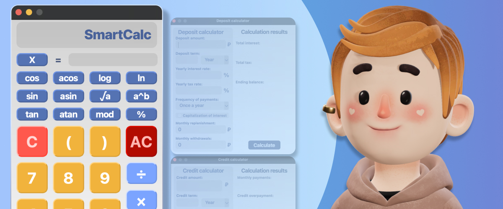

# **SmartCalc v1.0**

## **Описание проекта**
Проект "Калькулятор с графиками и финансовыми калькуляторами" представляет собой инновационное приложение, спроектированное для удовлетворения широкого спектра математических и финансовых потребностей пользователей. Проект был разделен на две ключевые части: "Backend" и "Frontend", что обеспечивает оптимизацию и четкое разграничение функциональности.

## **Backend**
Часть "Backend" была реализована на языке программирования C, с акцентом на эффективные математические расчеты. Основные функции включают:
- Расчет математических выражений с использованием обратной польской нотации, реализованный через алгоритм Дейкстры. Это позволяет обрабатывать сложные выражения, включая тригонометрические функции, математические операции и унарные знаки.
- Реализация кредитного калькулятора для оценки платежей и процентов по кредиту, и депозитного калькулятора для прогнозирования будущих доходов от депозитов.
- Сборка проекта с использованием Makefile, расположенного в папке src. Для установки приложения необходимо выполнить команду `make install`, для удаления - `make uninstall`.

## **Frontend**
Часть "Frontend" была создана с использованием языка программирования C++ и библиотеки Qt. Это обеспечивает удобный и интуитивно понятный интерфейс для пользователей. Основные функции включают:
- Математический калькулятор с возможностью выполнения различных операций, включая арифметические действия и тригонометрические функции.
- Графический модуль для построения графиков функций с использованием библиотеки QCustomPlot. Это позволяет визуализировать математические зависимости и настраивать параметры графиков.
- Интерфейс для использования кредитного и депозитного калькуляторов, что делает приложение полезным инструментом для финансового планирования.

## **Калькулятор и построение графиков** 

 Калькулятор способен производить расчет выражений в инфиксной записи. 
 Также он способен производить расчет выражений с переменной `x` и подстановкой его значений в виде числа.
 Ввод выражения осуществляется с помощью интерфейса, а затем пользователь может нажать на знак "=" для получения результата.

- Интерфейс и функциональность обычного калькулятора и графиков были вдохновлены принципами и дизайном калькулятора Google. Это обеспечивает знакомую и удобную среду для пользователей.

## **Кредитный калькулятор**

Кредитный калькулятор предоставляет возможность оценить параметры и затраты по кредиту перед его взятием. Он рассчитывает месячные платежи на основе суммы кредита, процентной ставки и срока, учитывая аннуитетные или дифференцированные платежи, а также дополнительные взносы и досрочные погашения. Пользователь может сравнить варианты кредитных условий, увидеть общую сумму платежей, месячную переплату и сумму процентов.

- Для разработки кредитного калькулятора использовались принципы и алгоритмы с сайта calcus.ru, гарантируя точные и надежные расчеты по кредитам.

## **Депозитный калькулятор** 
Депозитный калькулятор предоставляет возможность оценить доходность и налогообложение депозита перед его размещением. Он расчитывает начисленные проценты в зависимости от суммы депозита, срока размещения, процентной ставки, налоговой ставки, периодичности выплат и капитализации процентов. Калькулятор также учитывает ежемесячные пополнения и частичные снятия, позволяя оценить влияние дополнительных взносов на итоговую сумму. На выходе калькулятор предоставляет информацию о начисленных процентах, сумме налога и общей сумме на депозите к концу срока. Это позволяет принять информированное решение о размещении денежных средств и оптимизации финансовых ресурсов.

- Для депозитного калькулятора использовались данные и методология расчетов с сайта banki.ru, обеспечивая точность и актуальность данных.

**Технические детали:**
- Язык программирования Backend: C
- Язык программирования Frontend: C++
- Библиотеки: Qt для создания пользовательского интерфейса, QCustomPlot для построения графиков, стандартная библиотека C для математических расчетов
- Алгоритм обратной польской нотации: реализован на языке C для обработки математических выражений