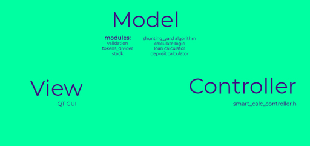
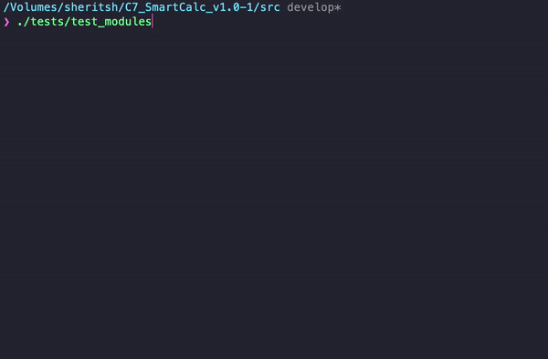

# SmartCalc v1.0

This project is part of the curriculum of [School 21](https://21-school.ru/). According to task, an extended version of the calculator was implemented in the C programming language using structured programming. In addition to basic arithmetic operations such as add/subtract and multiply/divide, calculator can calculate arithmetic expressions by following the order, as well as some mathematical functions (sine, cosine, logarithm, etc.).  
In addition to calculating expressions, the calculator also supports the use of the _x_ variable and plotting the corresponding function. There is also a built-in loan and deposit calculator. The project is written using the MVC pattern. Logic and graphical interface have been separated, all modules are covered with tests. For the visual part of the project, the Qt framework was used.

Russian version of README you can find [here](./README_RUS.md)

## Contents

1. [Installation and commands](#installation-and-commands)
2. [Calculator overview](#calculator-overview)
3. [MVC Model](#mvc-model)
4. [Tests](#tests)
5. [Technical specifications](#technical-specifications)

## Installation and commands

You will need the following utilities to install `gcc`, `make` and `qmake`

##### Makefile targets:

- **install**  
  Installs the calculator in the build folder and on the desktop

- **uninstall**  
  Uninstall the calculator

- **dvi**  
  Opens project documentation

- **dist**  
  Generates distribution `.tgz` with an executable and necessary documentation

- **test**  
  Start testing calculator modules and its controller. The report can be viewed in the `/tests/logs` folder

- **gcov_report**  
  Generates an html report displaying the coverage of all functions by tests

- **valgrind_check**  
  Initializes the check of the project by the valgrind utility, after which log files with reports are created

## Calculator overview

## MVC Model

All program logic (model) and GUI have been separated and linked via smart_calc_controller.  
The model is independent and each of its modules is covered by tests.

## Tests

- Tests were written using [check](https://libcheck.github.io/check/) library // coverage report using [LCOV](https://github.com/linux-test-project/lcov)

## Technical specifications

The SmartCalc v1.0 program must be implemented:

- The program must be developed in C language of C11 standard using gcc compiler. You can use any additional QT libraries and modules
- The program code must be located in the src folder
- The program must be built with Makefile which contains standard set of targets for GNU-programs: all, install, uninstall, clean, dvi, dist, test, gcov_report. Installation directory could be arbitrary, except the building one
- The program must be developed according to the principles of structured programming
- When writing code it is necessary to follow the Google style
- Prepare full coverage of modules related to calculating expressions with unit-tests using the Check library
- GUI implementation, based on any GUI library with API for C89/C99/C11
   For Linix: GTK+, CEF, Qt
   For Mac: GTK+, Nuklear, raygui, microui, libagar, libui, IUP, LCUI, CEF, Qt
- Both integers and real numbers with a dot can be input into the program. You can optionally provide the input of numbers in exponential notation
- The calculation must be done after you complete entering the calculating expression and press the `=` symbol.
- Calculating arbitrary bracketed arithmetic expressions in infix notation
- Calculate arbitrary bracketed arithmetic expressions in infix notation with substitution of the value of the variable _x_ as a number
- Plotting a graph of a function given by an expression in infix notation with the variable _x_ (with coordinate axes, mark of the used scale and an adaptive grid)
  - It is not necessary to provide the user with the ability to change the scale
- Domain and codomain of a function are limited to at least numbers from -1000000 to 1000000
  - To plot a graph of a function it is necessary to additionally specify the displayed domain and codomain
- Verifiable accuracy of the fractional part is at least to 7 decimal places
- Users must be able to enter up to 255 characters
- Bracketed arithmetic expressions in infix notation must support the following arithmetic operations and mathematical functions:

  - **Arithmetic operators**:

    | Operator name  | Infix notation   (Classic) | Prefix notation   (Polish notation) | Postfix notation   (Reverse Polish notation) |
    | -------------- | ------------------------------- | ---------------------------------------- | ------------------------------------------------- |
    | Brackets       | (a + b)                         | (+ a b)                                  | a b +                                             |
    | Addition       | a + b                           | + a b                                    | a b +                                             |
    | Subtraction    | a - b                           | - a b                                    | a b -                                             |
    | Multiplication | a \* b                          | \* a b                                   | a b \*                                            |
    | Division       | a / b                           | / a b                                    | a b \                                             |
    | Power          | a ^ b                           | ^ a b                                    | a b ^                                             |
    | Modulus        | a mod b                         | mod a b                                  | a b mod                                           |
    | Unary plus     | +a                              | +a                                       | a+                                                |
    | Unary minus    | -a                              | -a                                       | a-                                                |

    > Note that the multiplication operator contains the obligatory sign `*`. Processing an expression with the omitted `*` sign is optional and is left to the developer's decision

  - **Functions**:

    | Function description       | Function |
    | -------------------------- | -------- |
    | Computes cosine            | cos(x)   |
    | Computes sine              | sin(x)   |
    | Computes tangent           | tan(x)   |
    | Computes arc cosine        | acos(x)  |
    | Computes arc sine          | asin(x)  |
    | Computes arc tangent       | atan(x)  |
    | Computes square root       | sqrt(x)  |
    | Computes natural logarithm | ln(x)    |
    | Computes common logarithm  | log(x)   |

### Bonus. Credit calculator

Provide a special mode "credit calculator" (you can take banki.ru and calcus.ru as an example):

- Input: total credit amount, term, interest rate, type (annuity, differentiated)
- Output: monthly payment, overpayment on credit, total payment

### Bonus. Deposit calculator

Provide a special mode "deposit profitability calculator" (you can take banki.ru and calcus.ru as an example):

- Input: deposit amount, deposit term, interest rate, tax rate, periodicity of payments, capitalization of interest, replenishments list, partial withdrawals list
- Output: accrued interest, tax amount, deposit amount by the end of the term
